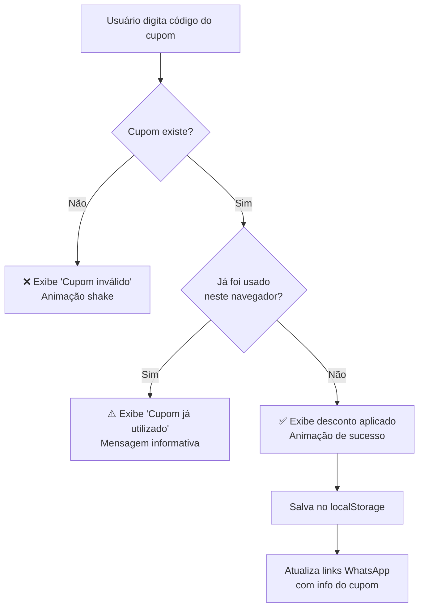

# Sistema de Cupons de Uso Único — Ki Frango Crocante

## Contexto

O projeto Ki Frango Crocante é um site estático (HTML/CSS/JS puro) sem backend. Os pedidos são feitos via WhatsApp. O objetivo é implementar um sistema de cupons que pode ser usado **apenas 1 vez por usuário**, oferecendo desconto nos itens do cardápio.

## User Review Required

> [!IMPORTANT]
> **Sem backend**: Como o projeto é 100% frontend, a persistência será feita via `localStorage`. Isso significa que:
> - O controle de uso único é **por navegador/dispositivo** (limpar dados = pode reusar)
> - Para um controle **real** anti-fraude, seria necessário um backend (Firebase, Supabase, etc.)
> - A abordagem via `localStorage` é suficiente para uso casual e funciona bem para a maioria dos clientes

> [!IMPORTANT]
> **Integração com WhatsApp**: O cupom validado será incluído automaticamente na mensagem do WhatsApp, para que o atendente saiba que o desconto foi aplicado.

## Open Questions

1. **Quais cupons criar?** Sugestão de cupons iniciais:
   - `PRIMEIRAVISITA` — 15% de desconto (boas-vindas)
   - `KIFRANGO10` — R$10 de desconto
   - `FRANGOFREE` — Nuggets grátis na compra de qualquer burger
   
   Você quer esses ou tem outros em mente?

2. **Onde posicionar o campo de cupom?** Sugestão: um banner/seção entre o cardápio e os combos, com visual destacado. Alternativa: dentro de cada card de produto.

3. **Desconto percentual ou valor fixo?** O sistema pode suportar ambos.

## Proposed Changes

### Componente: Seção de Cupom (UI)

#### [MODIFY] [index.html](file:///c:/Users/user0636/.gemini/antigravity-ide/scratch/ki-frango-crocante/index.html)

Adicionar uma nova seção de cupom entre o cardápio (`#menu`) e a seção parallax de estatísticas. A seção terá:
- Campo de input estilizado para digitar o código do cupom
- Botão "Aplicar Cupom"
- Área de feedback visual (válido ✅ / inválido ❌ / já usado ⚠️)
- Exibição do desconto aplicado com animação

```html
<!-- ===== Seção Cupom ===== -->
<section class="section coupon-section" id="coupon">
  <div class="coupon-card">
    <div class="coupon-icon">🎟️</div>
    <h3>Tem um Cupom de Desconto?</h3>
    <p>Insira seu código abaixo e aproveite!</p>
    <div class="coupon-input-group">
      <input type="text" id="couponInput" placeholder="Digite seu cupom" maxlength="20">
      <button id="couponApplyBtn">Aplicar</button>
    </div>
    <div class="coupon-feedback" id="couponFeedback"></div>
  </div>
</section>
```

---

### Componente: Estilos do Cupom

#### [MODIFY] [styles.css](file:///c:/Users/user0636/.gemini/antigravity-ide/scratch/ki-frango-crocante/styles.css)

Adicionar estilos para a seção de cupom, incluindo:
- Card com efeito glassmorphism (consistente com o design existente)
- Input estilizado com borda animada
- Estados de feedback com cores: verde (sucesso), vermelho (inválido), amarelo (já usado)
- Micro-animações de shake (erro) e bounce (sucesso)
- Responsividade mobile

---

### Componente: Lógica de Validação

#### [MODIFY] [script.js](file:///c:/Users/user0636/.gemini/antigravity-ide/scratch/ki-frango-crocante/script.js)

Adicionar sistema completo de cupons com:

1. **Base de cupons** — Objeto com códigos, tipo de desconto e descrição:
   ```javascript
   const COUPONS = {
     'PRIMEIRAVISITA': { discount: 15, type: 'percent', description: '15% de desconto' },
     'KIFRANGO10': { discount: 10, type: 'fixed', description: 'R$10 de desconto' },
     'FRANGOFREE': { discount: 0, type: 'freebie', description: 'Nuggets grátis no combo' }
   };
   ```

2. **Validação com `localStorage`**:
   - Ao aplicar: verificar se o cupom existe → verificar se já foi usado → marcar como usado
   - Chave no localStorage: `kifrango_used_coupons` (array de códigos já usados)

3. **Feedback visual**:
   - ✅ Cupom válido: mostra desconto + animação de confete
   - ❌ Cupom inválido: mensagem de erro + animação shake
   - ⚠️ Cupom já utilizado: mensagem informativa

4. **Integração com WhatsApp**:
   - Ao aplicar um cupom válido, os botões de "Pedir" passam a incluir o código do cupom na mensagem do WhatsApp
   - Ex: `"Olá! Gostaria de pedir um Ki Frango Clássico! 🎟️ Cupom: PRIMEIRAVISITA (15% off)"`

### Fluxo do Usuário



## Verification Plan

### Manual Verification
- Abrir o site no navegador e testar:
  1. Inserir cupom válido → verificar feedback de sucesso e desconto exibido
  2. Tentar reusar o mesmo cupom → verificar mensagem "já utilizado"
  3. Inserir cupom inválido → verificar mensagem de erro
  4. Clicar em "Pedir pelo WhatsApp" → verificar que o cupom aparece na mensagem
  5. Testar responsividade no mobile
  6. Verificar que a seção de cupom mantém a estética premium do site
